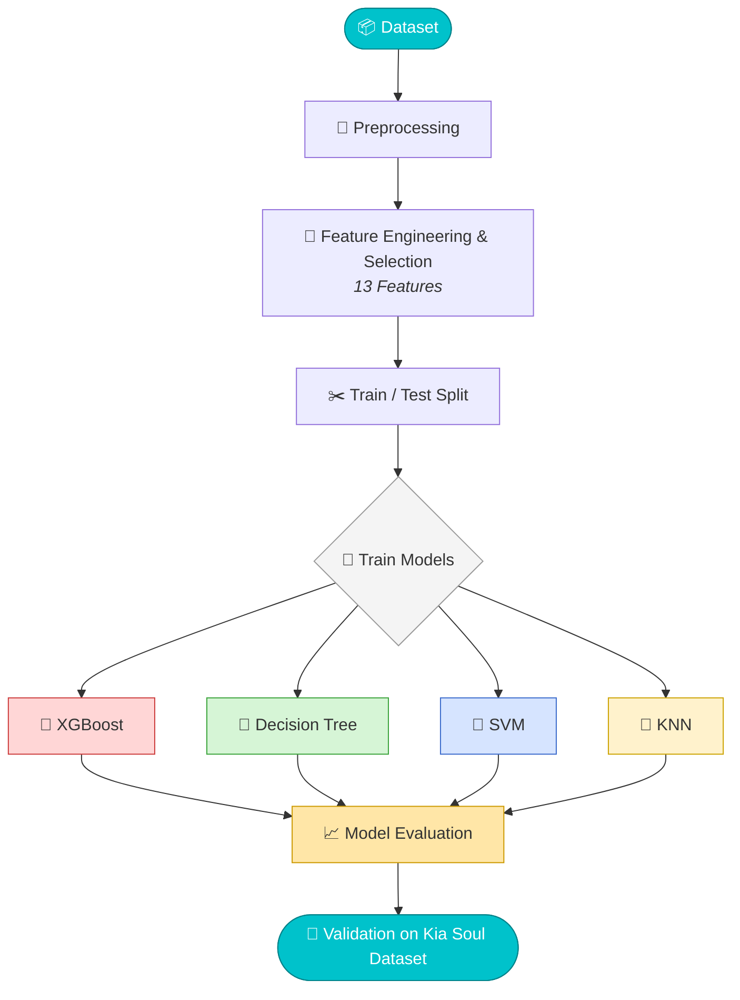

<div align="center">


<br/>


</div>

<br/>

<p align="center">

</p>

## 🚗 About the Project

**Drive-SecureX ML** is the machine learning core of **Drive-SecureX**, an Intrusion Detection System (IDS) built to detect cyber attacks on the **CAN Bus network** — the backbone communication protocol of modern vehicles. This module handles everything from raw CAN traffic to real-time-ready attack classification.

<br/>

## ✨ Features

<table align="center">
<tr>
<td align="center" width="200">🧹<br/><b>Data Preprocessing</b><br/><sub>Cleaning & structuring raw CAN traffic</sub></td>
<td align="center" width="200">🧪<br/><b>Feature Engineering</b><br/><sub>13 selected features</sub></td>
<td align="center" width="200">🤖<br/><b>Model Training</b><br/><sub>4 classifiers benchmarked</sub></td>
<td align="center" width="200">🔁<br/><b>Cross-Vehicle Validation</b><br/><sub>Generalization testing</sub></td>
</tr>
</table>

### 🧠 Classifiers

| Model | Icon | Role |
|---|---|---|
| **XGBoost** | 🚀 | High-performance gradient boosting |
| **Decision Tree (DT)** | 🌳 | Interpretable baseline |
| **Support Vector Machine (SVM)** | 📐 | Margin-based classification |
| **K-Nearest Neighbors (KNN)** | 📍 | Distance-based classification |

<br/>

## 📊 Datasets

<div align="center">

| Dataset | Purpose |
|---|---|
| 🗄️ **DSX CAN Dataset** | Train / Test |
| 🚙 **Kia Soul — CAN-MIRGU Dataset** | Cross-vehicle Validation |

</div>

<br/>

## 🛠️ Tech Stack

<div align="center">


&nbsp;

&nbsp;

&nbsp;

&nbsp;


</div>

<br/>

## 🔄 Workflow



<br/>

<p align="center">

</p>

<div align="center">

### 🚀 Get Started

```bash
git clone https://github.com/your-username/drive-securex-ml.git
cd drive-securex-ml
pip install -r requirements.txt
```

<br/>

⭐ **If this project helped you, consider giving it a star!** ⭐

</div>
